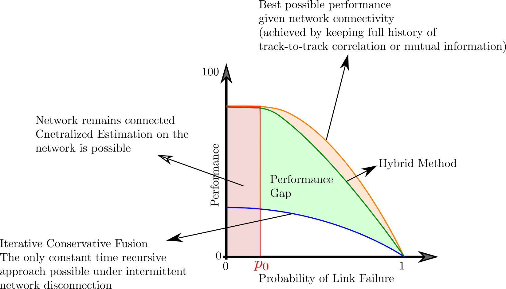

# DSE_ON_HMMs

This is the code related to the following paper

A. Tamjidi, R. Oftadeh, S. Chakravorty, and D. A. Shell, **"Efficient Distributed State Estimation of Hidden Markov Models over Unreliable Networks"**, in Proceedings of the International Symposium on Multi-Robot and Multi-Agent Systems (MRS), Los Angeles, California, December 2017. ([PDF](http://robotics.cs.tamu.edu/dshell/papers/mrs2017dse.pdf)) [Acceptance Rate was 24%]

This paper won the [Best Student Paper Award](https://mrs2017.org/awards/) in MRS 2017

The following figure compares the extisting methods with the Hybrid method introduced in this paper.

